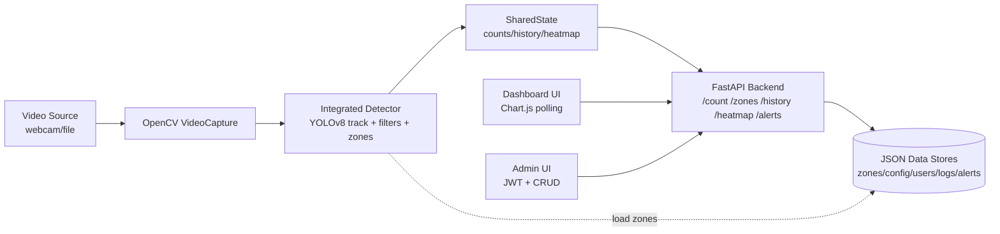
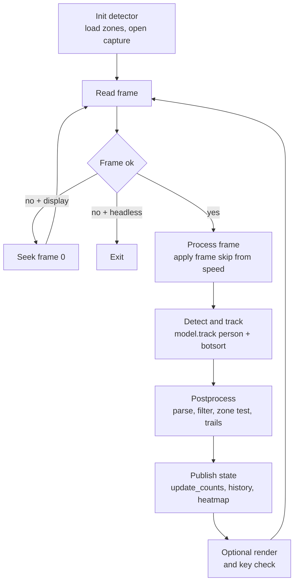

# YOLOv8 People Detection and Zone Management System — Code-Grounded Technical Extraction

Date: 2026-04-19  
Context: This technical extraction is designed to be shareable even without the source repository.

Notes on paths and links:

- Any paths are shown as repository-relative placeholders (e.g., `<repo_root>/detector/integrated_detector.py`) for provenance.
- If you do not have the repository, treat these as component labels (the narrative + embedded snippets below are sufficient to write a paper).

---

[MOTIVATION / USE CASE]

The repository frames two primary usage modes:

- **Monitoring/dashboard mode** (FastAPI + browser UI): real-time people counting with zone monitoring, charts, heatmap, alerts, exports, and an admin panel with JWT/RBAC.
- **Standalone detection mode** (OpenCV UI): YOLOv8 detection + tracking with interactive zone drawing, zone statistics (current + unique visitors), and tracking trails.

Selected README excerpts (verbatim bullets):

- From `README_DASHBOARD.md` (Features):
    - Real-time people counting with YOLOv8 detection and tracking
    - Zone-based monitoring with customizable polygonal zones
    - Crowd density heatmap with periodic updates
    - Configurable alerts when crowd thresholds are exceeded
    - JWT-based authentication with role-based access control (RBAC)

- From `README_BYTETRACK.md` (Features):
    - YOLOv8 Detection
    - BYTETrack Integration
    - Interactive Zone Drawing
    - Zone Statistics (current count + total unique visitors)

[ARCHITECTURE]

Pipeline:

1. **Input acquisition**: OpenCV ingests a webcam index (e.g., `0`) or a file/URL string via `cv2.VideoCapture(video_source)` in the integrated pipeline (typical implementation: `<repo_root>/detector/integrated_detector.py`).
2. **Frame sampling / speed control**: `speed` is converted into integer `frame_skip = max(1, int(speed))`, and frames are skipped when `frames_read % frame_skip != 0`.
3. **Detection + tracking**: Each processed frame is passed to Ultralytics YOLOv8 `model.track(...)` with person-class filtering (`classes=[0]`) and tracker configuration `tracker="botsort.yaml"`.
4. **Post-tracking filtering**: Detections are filtered by confidence (`conf < conf_threshold`), minimum box area (`box_area < min_box_area`), and aspect ratio bounds (`<0.15` or `>2.0`).
5. **Zone analysis**: Each accepted detection computes a center point and assigns zone membership by polygon containment using `cv2.pointPolygonTest(...) >= 0` (boundary-inclusive).
6. **Statistics update**:
    - Per-frame zone occupancy `zone_current_count` is rebuilt each frame.
    - Unique visitors per zone accumulate as a `set(track_id)` across frames (`zone_visitors`).
7. **Shared-state publication**: The detector extracts per-detection center coordinates and publishes the latest snapshot via `shared_state.update_counts(...)` (typical implementation: `<repo_root>/detector/integrated_detector.py` → `update_shared_state`).
8. **Heatmap + history accumulation** (shared state): `SharedState.update_counts(...)` appends a history record and updates a heatmap accumulator by drawing filled circles at person centers (radius=30) (typical implementation: `<repo_root>/shared_state.py` → `update_counts`).
9. **Outputs**:
    - **Local visualization**: annotated OpenCV window (boxes, ID+confidence text, zone overlays, trails, status text).

- **REST API**: FastAPI endpoints expose counts/zones/history/heatmap/alerts and exports.
- **Dashboard UI**: Browser dashboard polls endpoints at fixed intervals and renders Chart.js charts and heatmap PNG.

Key components (typical repository layout):

- `<repo_root>/run_app.py` → Orchestrates running the FastAPI server and detector together; starts the server in a daemon thread and runs the detector loop in the main thread (OpenCV UI).
- `<repo_root>/detector/integrated_detector.py` → Primary integrated detector: YOLOv8 tracking, filtering, zone membership, trail drawing, interactive zone drawing, shared-state updates, frame skipping.
- `<repo_root>/shared_state.py` → Thread-safe singleton shared between detector and API: counts, zone stats, coordinates, heatmap accumulator, history deque, thresholds, alert evaluation.
- `<repo_root>/backend/api.py` → FastAPI app: public endpoints (`/count`, `/zones`, `/history`, `/heatmap`, `/alerts`, exports), optional WebSocket, static mount for frontend.
- `<repo_root>/backend/admin.py` + `<repo_root>/backend/auth.py` + `<repo_root>/backend/middleware.py` → Admin/auth/RBAC.
- `<repo_root>/backend/logging_service.py` + `<repo_root>/backend/models.py` → Audit logging persistence + Pydantic schemas.
- `<repo_root>/frontend/index.html` + `<repo_root>/frontend/login.html` + `<repo_root>/frontend/admin.*` → Dashboard and admin frontend.
- `<repo_root>/zones.json` → Polygon zone definitions.
- `<repo_root>/people_detector_bytetrack.py` + `<repo_root>/zone_manager.py` → Standalone detector and interactive zone editor.

Key Classes:

- `IntegratedPeopleDetector` (typical implementation: `<repo_root>/detector/integrated_detector.py`)
    - Purpose: end-to-end detector with dashboard integration.
    - Key attributes:
        - `model`: Ultralytics `YOLO` instance.
        - `zones`: dict loaded from the project’s zone-definition JSON (typical location: `<repo_root>/zones.json`).
        - `track_history`: recent centers per `track_id` (bounded trail length).
        - `zone_visitors`: unique IDs per zone (set accumulation).
        - `zone_current_count`: per-zone occupancy for the current frame.
        - `recent_track_ids`, `frame_counter`, `id_memory_frames`: short-term ID bookkeeping for occlusions.
    - Key methods:
        - `process_video(...)`: frame loop, frame-skip, UI, and detector lifecycle flags.
        - `detect_people(frame)`: YOLO track call + parsing + filters + zone membership + trail update + shared-state update.
        - `point_in_zone(...)` / `get_person_zone(...)`: polygon containment and zone name assignment.
        - `update_zone_statistics(detections)`: rebuild `zone_current_count` and update `zone_visitors`.
        - `update_shared_state(detections)`: publish snapshot to `shared_state`.

- `SharedState` (typical implementation: `<repo_root>/shared_state.py`)
    - Purpose: thread-safe shared state between detector and API.
    - Key attributes:
        - `_total_count`, `_zone_counts`, `_zone_visitors`, `_person_coordinates`
        - `_heatmap_accumulator` (`np.ndarray` float32) and `_frame_dimensions`
        - `_history`: bounded deque of `{timestamp, total_count, zone_counts}`
        - thresholds: global + per-zone thresholds and active alert keys
    - Key methods:
        - `update_counts(...)`: atomic snapshot update + heatmap update + history append
        - `get_zone_counts()`: returns `{zone: {current, total_visitors}}` derived from in-memory visitor sets
        - `get_heatmap_image()`: normalize + blur + colormap + PNG encoding
        - `check_alerts()`: threshold breach evaluation (global + per-zone)
        - `check_alerts_and_record()`: threshold evaluation + edge-triggered persistence for newly-triggered breaches

- `ConnectionManager` (typical implementation: `<repo_root>/backend/api.py`)
    - Purpose: store active WebSocket connections and broadcast JSON.

- `RoleChecker` and RBAC dependencies (typical implementation: `<repo_root>/backend/middleware.py`)
    - Purpose: enforce authentication and role-based access.
    - Key methods: `get_current_user`, `require_admin`.

- `PeopleDetector` (standalone) (typical implementation: `<repo_root>/people_detector_bytetrack.py`)
    - Purpose: detector without shared_state publishing; includes zone overlays, trails, and zone stats.
    - Notable: uses `tracker="botsort.yaml"` as well.

- `ZoneManager` (typical implementation: `<repo_root>/zone_manager.py`)
    - Purpose: interactive polygon-zone editor for [zones.json](zones.json#L1-L30).

Data Flow:

- Directed graph (runtime)
    - Node A: `cv2.VideoCapture(video_source)` → Node B: `IntegratedPeopleDetector.process_video`
    - Node B → Node C: `IntegratedPeopleDetector.detect_people(frame)`
    - Node C → Node D: Ultralytics YOLO `model.track(...)`
    - Node C → Node E: filtering + center-point computation + zone membership
    - Node E → Node F: per-frame zone counts + visitor sets (`update_zone_statistics`)
    - Node F → Node G: `shared_state.update_counts(...)` ([detector/integrated_detector.py](detector/integrated_detector.py#L186-L205))
    - Node G → Node H: FastAPI endpoints return JSON/PNG derived from shared_state ([backend/api.py](backend/api.py#L91-L201))
    - Node H → Node I: Dashboard polling (`fetchCount`, `fetchZones`, `fetchAlerts`, `fetchHistory`, `updateHeatmap`) ([frontend/index.html](frontend/index.html#L493-L881))

Threading / async:

- The server is started in a background thread: `server_thread = threading.Thread(..., daemon=True)` ([run_app.py](run_app.py#L145-L152)).
- The detector loop runs in the main thread (OpenCV UI) ([run_app.py](run_app.py#L154-L163)).
- FastAPI endpoints are `async def` and the WebSocket endpoint runs an infinite async loop with `await asyncio.sleep(1)` ([backend/api.py](backend/api.py#L436-L455)).
- `SharedState` protects concurrent reads/writes using an `RLock` (`self._state_lock`) ([shared_state.py](shared_state.py#L34-L38)).

YOLOv8 Integration:

- Model instantiation: `self.model = YOLO(model_path)` ([detector/integrated_detector.py](detector/integrated_detector.py#L59-L61)).
- Core call: `self.model.track(frame, persist=True, classes=[0], conf=..., iou=..., tracker="botsort.yaml", verbose=False)` ([detector/integrated_detector.py](detector/integrated_detector.py#L293-L308)).
- Results parsing:
    - `boxes = results[0].boxes.xyxy.cpu().numpy()`
    - `track_ids = results[0].boxes.id.cpu().numpy().astype(int)`
    - `confidences = results[0].boxes.conf.cpu().numpy()` ([detector/integrated_detector.py](detector/integrated_detector.py#L316-L324)).

---

[ALGORITHMS]

Detection:

- Class filtering: only person class is processed via `classes=[0]` in `model.track(...)` ([detector/integrated_detector.py](detector/integrated_detector.py#L293-L308)).
- Thresholds (defaults in integrated detector):
    - `DEFAULT_CONFIDENCE_THRESHOLD = 0.5` ([detector/integrated_detector.py](detector/integrated_detector.py#L39-L41))
    - `DEFAULT_MIN_BOX_AREA = 1500` ([detector/integrated_detector.py](detector/integrated_detector.py#L39-L41))
    - `DEFAULT_IOU_THRESHOLD = 0.5` ([detector/integrated_detector.py](detector/integrated_detector.py#L39-L41))
- Post-tracking filters (executed per candidate detection):
    - Confidence check: `if conf < self.conf_threshold: continue` ([detector/integrated_detector.py](detector/integrated_detector.py#L326-L329)).
    - Min area: `if box_area < self.min_box_area: continue` ([detector/integrated_detector.py](detector/integrated_detector.py#L331-L336)).
    - Aspect ratio bounds: reject if `aspect_ratio > 2.0 or aspect_ratio < 0.15` ([detector/integrated_detector.py](detector/integrated_detector.py#L338-L340)).

Tracking:

- Tracking is delegated to Ultralytics via `model.track(...)` with `persist=True` and tracker config name `"botsort.yaml"` ([detector/integrated_detector.py](detector/integrated_detector.py#L293-L308)).
- Tracker parameters: `tracker="botsort.yaml"` resolves to Ultralytics BoT-SORT defaults (not stored in this repo). Observed defaults in the current environment (`ultralytics==8.3.241`) include:
    - `tracker_type: botsort`
    - `track_high_thresh: 0.25`, `track_low_thresh: 0.10`, `new_track_thresh: 0.25`
    - `track_buffer: 30`, `match_thresh: 0.80`, `fuse_score: True`
    - `gmc_method: sparseOptFlow`
    - `with_reid: False`, `proximity_thresh: 0.50`, `appearance_thresh: 0.80`
    - Reproducibility note: [requirements.txt](requirements.txt#L1-L24) specifies `ultralytics>=8.0.0` (not pinned), so exact tracker defaults may differ across environments.

- Unique ID assignment is not implemented manually; IDs are read from `results[0].boxes.id` and cast to int ([detector/integrated_detector.py](detector/integrated_detector.py#L316-L324)).
- The standalone detector also uses BoT-SORT config name `"botsort.yaml"` ([people_detector_bytetrack.py](people_detector_bytetrack.py#L239-L246)).

Zone Containment:

- Algorithm: OpenCV polygon point test (`cv2.pointPolygonTest`) on the **center point** of each detection.
- Boundary behavior: `>= 0` treats boundary points as inside.

Code snippet (integrated detector):

```python
def point_in_zone(self, point, zone_points):
    return cv2.pointPolygonTest(np.array(zone_points, dtype=np.int32), point, False) >= 0
```

Source: [detector/integrated_detector.py](detector/integrated_detector.py#L155-L158)

Trail Management:

- Data structure: `self.track_history = defaultdict(lambda: [])` keyed by `track_id` ([detector/integrated_detector.py](detector/integrated_detector.py#L67-L69)).
- Eviction policy: append per frame; if length exceeds 30, drop oldest point (`pop(0)`) ([detector/integrated_detector.py](detector/integrated_detector.py#L396-L402)).

Zone Stats:

- Current occupancy: `zone_current_count` is cleared each update and recomputed from `detections` ([detector/integrated_detector.py](detector/integrated_detector.py#L171-L184)).
- Unique visitors: `zone_visitors[zone_name].add(track_id)` adds any ID present in that zone in the current frame; there is **no explicit "enter" event** (e.g., edge-trigger on zone boundary crossing) ([detector/integrated_detector.py](detector/integrated_detector.py#L179-L184)).

Optimizations:

- Frame skipping for speed: integer `frame_skip` derived from `speed`, skipping frames via modulo test ([detector/integrated_detector.py](detector/integrated_detector.py#L437-L494)).
- End-of-video looping (integrated pipeline): when `cap.read()` fails, reset position to frame 0 and continue ([detector/integrated_detector.py](detector/integrated_detector.py#L479-L486)).
- Standalone detector does **not** loop; it breaks on `ret == False` ([people_detector_bytetrack.py](people_detector_bytetrack.py#L397-L401)).

---

[DATA]

Zone Schema:

- Source: `zones.json` (project file)
- Schema (types):
    - Top-level: `{ "zones": Zone[] }`
    - `Zone` object:
        - `name`: string
        - `points`: array of `[x:int, y:int]` pairs (polygon vertices)
        - `color`: `[R:int, G:int, B:int]` (0–255)
        - `enabled`: boolean
- Additional optional field supported by admin models but not used by the integrated detector logic:
    - `threshold?: int` in the admin-facing zone model (`ZoneBase`)

Zones configuration (verbatim file contents):

```json
{
    "zones": [
        {
            "name": "Zone_1",
            "points": [
                [2, 88],
                [2, 702],
                [1, 992],
                [860, 992],
                [889, 8],
                [4, 90]
            ],
            "color": [0, 255, 0],
            "enabled": true
        },
        {
            "name": "Zone_2",
            "points": [
                [889, 12],
                [1701, 24],
                [1703, 976],
                [863, 990]
            ],
            "color": [255, 0, 0],
            "enabled": true
        }
    ]
}
```

Generated zone-area table (already present in repo):

```csv
zone_name,enabled,points_count,area_px2
Zone_1,True,6,822238.00
Zone_2,True,4,797078.00
```

Zone State (disk vs memory):

- On disk: persistent zone definitions are stored in [zones.json](zones.json#L1-L30).
- In memory (detector): loaded at startup into `self.zones` via `load_zones()`; used for containment checks and drawing; changes to [zones.json](zones.json#L1-L30) are not reloaded unless the detector is restarted ([detector/integrated_detector.py](detector/integrated_detector.py#L106-L113)).
- In memory (admin): admin endpoints read/write the same [zones.json](zones.json#L1-L30) file via `ZONES_FILE` and `_load_zones()`/`_save_zones()` ([backend/admin.py](backend/admin.py#L45-L104), [backend/admin.py](backend/admin.py#L425-L536)).
- Interactive editing: `ZoneManager` provides a separate UI tool that reads/writes [zones.json](zones.json#L1-L30) ([zone_manager.py](zone_manager.py#L11-L260)).

Other persisted configuration/data (JSON files):

- [data/config.json](data/config.json): system config including camera list, thresholds, and log retention; loaded/saved by `_load_config()`/`_save_config()` ([backend/admin.py](backend/admin.py#L44-L86)).
- [data/users.json](data/users.json): user accounts/roles; loaded/saved by `load_users()`/`save_users()` ([backend/auth.py](backend/auth.py#L34-L145)).
- [data/activity_logs.json](data/activity_logs.json): activity log store; written/read by logging service ([backend/logging_service.py](backend/logging_service.py#L22-L140)).
- [data/alerts_history.json](data/alerts_history.json): alert-history store; written/read by logging service ([backend/logging_service.py](backend/logging_service.py#L22-L355)).

In-memory State:

- `shared_state` is a global singleton instance of `SharedState` ([shared_state.py](shared_state.py#L239-L246)).
- Core state fields (private → type → meaning):
    - `_total_count: int` → total detections in latest frame ([shared_state.py](shared_state.py#L40-L44))
    - `_zone_counts: Dict[str, int]` → current counts per zone name (latest frame) ([shared_state.py](shared_state.py#L40-L44))
    - `_zone_visitors: Dict[str, set]` → unique visitor IDs per zone (cumulative) ([shared_state.py](shared_state.py#L40-L44))
    - `_person_coordinates: List[Tuple[int,int]]` → current centers (for heatmap) ([shared_state.py](shared_state.py#L45-L49))
    - `_heatmap_accumulator: Optional[np.ndarray]` → float32 accumulator image ([shared_state.py](shared_state.py#L45-L51))
    - `_frame_dimensions: Tuple[int,int]` → (height,width) used for heatmap ([shared_state.py](shared_state.py#L45-L51))
    - `_history: deque` (maxlen=3600) → time series of `{timestamp, total_count, zone_counts}` ([shared_state.py](shared_state.py#L49-L83))
    - `_global_threshold: int` and `_zone_thresholds: Dict[str,int]` → alert thresholds ([shared_state.py](shared_state.py#L55-L58))
    - `_detection_running: bool` → detector liveness flag ([shared_state.py](shared_state.py#L63-L64), [shared_state.py](shared_state.py#L220-L235))

Per-frame detection record (local, not persisted):

- Produced by `IntegratedPeopleDetector.detect_people(...)` as a list `detections: List[dict]` ([detector/integrated_detector.py](detector/integrated_detector.py#L268-L370)).
- Schema: `{id:int, bbox:[x1,y1,x2,y2], center:(cx:int,cy:int), confidence:float, zones:List[str]}` ([detector/integrated_detector.py](detector/integrated_detector.py#L356-L370)).
- Lifecycle: created per processed frame, consumed by `update_zone_statistics(...)` and `update_shared_state(...)`, then discarded (no on-disk persistence) ([detector/integrated_detector.py](detector/integrated_detector.py#L171-L205)).

Track History:

- Integrated detector: `track_history: defaultdict(list)` storing up to 30 `(x,y)` center tuples per `track_id` ([detector/integrated_detector.py](detector/integrated_detector.py#L67-L69), [detector/integrated_detector.py](detector/integrated_detector.py#L396-L402)).
- Standalone detector: identical structure and eviction (`>30 → pop(0)`) ([people_detector_bytetrack.py](people_detector_bytetrack.py#L47-L49), [people_detector_bytetrack.py](people_detector_bytetrack.py#L324-L326)).

Constants/Hyperparameters:

- Detector defaults:
    - `conf_threshold = 0.5` (reject low-confidence tracks), `min_box_area = 1500` (reject small boxes), `iou_threshold = 0.5` (IoU parameter passed into the YOLO tracking call) ([detector/integrated_detector.py](detector/integrated_detector.py#L39-L41)).
    - Aspect ratio bounds: `[0.15, 2.0]` (reject extreme shapes unlikely to be people) ([detector/integrated_detector.py](detector/integrated_detector.py#L338-L340)).
    - Trail max length: 30 points (caps stored/drawn trajectory history per ID) ([detector/integrated_detector.py](detector/integrated_detector.py#L396-L402)).
    - ID memory frames: 30 (declared as an occlusion/ID-memory knob; currently only `recent_track_ids` last-seen frames are stored) ([detector/integrated_detector.py](detector/integrated_detector.py#L74-L77)).
- Shared state:
    - History maxlen: 3600 entries (bounds history memory; intended “last hour” at ~1 sample/sec) ([shared_state.py](shared_state.py#L49-L53)).
    - Heatmap circle radius: 30 px (spreads each center point’s contribution in the accumulator) ([shared_state.py](shared_state.py#L95-L97)).
    - Heatmap blur kernel: (51,51) (smooths accumulator before colormapping) ([shared_state.py](shared_state.py#L141-L142)).
    - Colormap: JET (visual mapping from intensity to RGB) ([shared_state.py](shared_state.py#L144-L145)).
    - Default global threshold: 50 (alert threshold for total people count) ([shared_state.py](shared_state.py#L55-L58)).
- Frontend polling:
    - `UPDATE_INTERVAL = 1000 ms`, `HEATMAP_INTERVAL = 5000 ms`, `MAX_HISTORY_POINTS = 60` (dashboard polling/plot window) ([frontend/index.html](frontend/index.html#L464-L466)).

---

[PERFORMANCE]

Time Complexity:

- YOLOv8 detection+tracking: dominant per-frame cost; treated as model-dependent (not expressible purely as Big-O in repo code) ([detector/integrated_detector.py](detector/integrated_detector.py#L293-L308)).
- Post-filters + center computation: `O(N)` per processed frame, for `N` candidate tracks ([detector/integrated_detector.py](detector/integrated_detector.py#L326-L353)).
- Zone containment: `O(N · Z · P)` where `Z` is number of enabled zones and `P` is vertices per polygon; implemented via `pointPolygonTest` for each zone ([detector/integrated_detector.py](detector/integrated_detector.py#L159-L176)).
- Trail maintenance: `O(N)` appends + `O(1)` eviction (but `pop(0)` is `O(L)` on Python lists; with `L=30` it is bounded) ([detector/integrated_detector.py](detector/integrated_detector.py#L396-L402)).
- Heatmap update: `O(N · r^2)` per frame (draw filled circle radius `r=30`) ([shared_state.py](shared_state.py#L85-L97)).
- Heatmap generation per request: `O(H·W)` normalization + blur + colormap + PNG encoding (H,W = frame dimensions) ([shared_state.py](shared_state.py#L130-L162)).

Space Complexity:

- Heatmap accumulator: `O(H·W)` float32 array (4 bytes each), allocated when first updated ([shared_state.py](shared_state.py#L85-L91)).
- History: bounded by `maxlen=3600`, each entry stores `zone_counts` dict sized `O(Z)` ([shared_state.py](shared_state.py#L49-L83)).
- Trail history: `O(N·L)` with `L ≤ 30` points per ID ([detector/integrated_detector.py](detector/integrated_detector.py#L396-L402)).
- Unique visitors: `O(U)` where `U` is cumulative number of unique track IDs stored in per-zone sets (can grow unbounded until restart) ([detector/integrated_detector.py](detector/integrated_detector.py#L70-L73)).

Bottlenecks (ranked, based on code paths):

1. YOLOv8 `model.track(...)` inference + tracker update ([detector/integrated_detector.py](detector/integrated_detector.py#L293-L308)).
2. Heatmap retrieval (`GaussianBlur` + colormap + PNG encoding) every 5s in the dashboard by default ([shared_state.py](shared_state.py#L130-L162), [frontend/index.html](frontend/index.html#L465-L874)).
3. Per-frame copying of visitor sets in `SharedState.update_counts(...)` (`{k: v.copy() ...}`) as unique IDs grow ([shared_state.py](shared_state.py#L64-L76)).

Memory Estimate:

- Heatmap accumulator bytes ≈ `4 · H · W`.
    - Example: if `H=1080`, `W=1920`, bytes ≈ `4 · 1080 · 1920 ≈ 8.3 MB`.
- Trail storage points ≈ `N · L` where `L=30`.
- History entries ≤ 3600, each with `zone_counts` size `Z`.
- Visitor sets size grows with cumulative unique IDs; worst-case `|zone_visitors[zone]| ≈ total_unique_people_seen`.

---

[SHAREABLE ARTIFACTS: Sample run datasets]

This extraction includes (or can be accompanied by) a small “sample run” dataset under `paper/data/sample_run/` that backs the graphs described below. If you are sharing this Markdown without the repository, you can still cite the schema and example rows here.

`frame_timing.csv` (per processed frame timing + FPS) — header + first rows:

```csv
timestamp,frame_index,frames_read,source_fps,frame_width,frame_height,speed_frame_skip,people_count,infer_ms,post_ms,frame_ms,fps_inst
2026-04-19T22:23:32.047612,1,1,30,1958,1092,1,4,241.088,5.002,246.156,4.062
2026-04-19T22:23:32.109593,2,2,30,1958,1092,1,4,52.115,4.280,56.672,17.645
2026-04-19T22:23:32.161515,3,3,30,1958,1092,1,4,44.469,3.973,48.665,20.549
2026-04-19T22:23:32.204696,4,4,30,1958,1092,1,4,36.368,4.012,40.604,24.628
2026-04-19T22:23:32.252213,5,5,30,1958,1092,1,3,40.546,4.090,44.859,22.292
```

`confidence_scores.csv` (per accepted detection) — header + first rows:

```csv
timestamp,frame_index,track_id,confidence,zones,x1,y1,x2,y2,center_x,center_y,box_area
2026-04-19T22:23:32.047612,1,1,0.892644,Zone_1,0,815,343,1088,171,951,93639
2026-04-19T22:23:32.047612,1,2,0.783608,Zone_1,435,502,573,873,504,687,51198
2026-04-19T22:23:32.047612,1,3,0.741735,Zone_1,746,347,795,499,770,423,7448
2026-04-19T22:23:32.047612,1,4,0.505057,Zone_1,254,296,297,405,275,350,4687
2026-04-19T22:23:32.109593,2,1,0.898774,Zone_1,0,818,330,1088,165,953,89100
```

`zone_timeseries.csv` (per processed frame zone occupancy) — header + first rows:

```csv
timestamp,frame_index,total_count,Zone_1,Zone_2
2026-04-19T22:23:32.047612,1,4,4,0
2026-04-19T22:23:32.109593,2,4,4,0
2026-04-19T22:23:32.161515,3,4,4,0
2026-04-19T22:23:32.204696,4,4,4,0
2026-04-19T22:23:32.252213,5,3,3,0
```

`track_summaries.csv` (per track lifecycle summary) — header + first rows:

```csv
track_id,first_frame,last_frame,frames_seen,first_timestamp,last_timestamp,duration_frames,max_trail_len,last_confidence
1,1,4,4,2026-04-19T22:23:32.047612,2026-04-19T22:23:32.204696,4,4,0.896884
2,1,120,120,2026-04-19T22:23:32.047612,2026-04-19T22:23:39.185510,120,30,0.791946
3,1,120,120,2026-04-19T22:23:32.047612,2026-04-19T22:23:39.185510,120,30,0.737171
4,1,15,12,2026-04-19T22:23:32.047612,2026-04-19T22:23:32.704243,15,12,0.509963
6,14,87,68,2026-04-19T22:23:32.662243,2026-04-19T22:23:37.047173,74,30,0.599646
```

`history_dump.json` (API-shaped history dump) — schema excerpt:

```json
{
    "history": [
        {
            "timestamp": "2026-04-19T22:23:32.047612",
            "total_count": 4,
            "zone_counts": {"Zone_1": 4}
        }
    ]
}
```

[GRAPH: Detection confidence distribution]
Type: Histogram
X-axis: Confidence score (unitless, 0–1)
Y-axis: Count of detections
Data Source: `paper/data/<run>/confidence_scores.csv` (emitted by `detector/metrics_logger.py` during a run)
Sample Data or Formula:

- Persisted per accepted detection in `confidence_scores.csv`.
- Reproduction command (writes CSV/JSON to `paper/data/<run>/`):

```bash
python run_app.py --detector-only --no-display --source <VIDEO_SOURCE> --model <MODEL_WEIGHTS> --metrics-out paper/data/<run> --max-frames <N>
```

- Plot column: `confidence`.
- Note: first frame can include model warm-up (treat as an outlier if desired).
  Paper Caption: "Distribution of YOLOv8 person detection confidence scores over the evaluated video sequence."

[GRAPH: Zone occupancy over time]
Type: Multi-line plot (one line per zone) or stacked area
X-axis: Timestamp (ISO 8601)
Y-axis: People count per zone
Data Source: `paper/data/<run>/zone_timeseries.csv` (plot-ready) and `paper/data/<run>/history_dump.json` (API-shaped)
Sample Data or Formula:

- Each history entry has:
    - `timestamp`, `total_count`, `zone_counts` ([shared_state.py](shared_state.py#L81-L86))
- Note: history is appended every detector update (per processed frame), not strictly 1 Hz.
  Paper Caption: "Per-zone occupancy time series derived from per-frame zone membership assignment."

[GRAPH: Unique visitor accumulation curve]
Type: Line plot (one line per zone)
X-axis: Time (timestamp) or frame index
Y-axis: Cumulative unique visitors (IDs)
Data Source: `SharedState._zone_visitors` and detector `zone_visitors`
Sample Data or Formula:

- Current API exposes only the _current snapshot_ total visitors per zone via `get_zone_counts()` (computed as `len(_zone_visitors[zone])`) ([shared_state.py](shared_state.py#L112-L122), [backend/api.py](backend/api.py#L115-L126)).
- **Not persisted over time** in `_history` (history stores only `zone_counts`) ([shared_state.py](shared_state.py#L49-L86)).
  Paper Caption: "Cumulative unique visitors per zone; requires external logging or code instrumentation to persist per-timestep totals."

[GRAPH: Trail length distribution]
Type: Histogram
X-axis: Trail length (#points)
Y-axis: Count of active track IDs
Data Source: `paper/data/<run>/track_summaries.csv` (`max_trail_len`)
Sample Data or Formula:

- Trails are bounded at 30 points and exist only in-memory during execution ([detector/integrated_detector.py](detector/integrated_detector.py#L396-L402)).
- Persisted per track as `max_trail_len` in `track_summaries.csv`.
  Paper Caption: "Distribution of per-ID trajectory history lengths (bounded by a 30-frame cap)."

[GRAPH: ID lifecycle (persistence length)]
Type: Histogram or survival curve
X-axis: Lifetime (frames or seconds)
Y-axis: Count of track IDs
Data Source: `paper/data/<run>/track_summaries.csv` (`duration_frames`, `frames_seen`, `first_timestamp`, `last_timestamp`)
Sample Data or Formula:

- Integrated detector maintains `recent_track_ids = {track_id: last_seen_frame}` for runtime bookkeeping ([detector/integrated_detector.py](detector/integrated_detector.py#L74-L77), [detector/integrated_detector.py](detector/integrated_detector.py#L348-L349)).
- Persisted per track in `track_summaries.csv`.
  Paper Caption: "Track ID lifetime distribution under BoT-SORT tracking; first/last seen are logged per track during evaluation runs."

[GRAPH: FPS / processing time per frame]
Type: Line plot (FPS vs time) or histogram (frame latency)
X-axis: Time or frame index
Y-axis: FPS (frames/sec) or latency (ms)
Data Source: `paper/data/<run>/frame_timing.csv` (`infer_ms`, `post_ms`, `frame_ms`, `fps_inst`)
Sample Data or Formula:

- Code reads source FPS from OpenCV capture: `fps = int(cap.get(cv2.CAP_PROP_FPS)) or 30` ([detector/integrated_detector.py](detector/integrated_detector.py#L433-L436)).
- Measured FPS/latency is persisted per processed frame in `frame_timing.csv`.
  Paper Caption: "Measured throughput of the detection pipeline (per-frame latency and instantaneous FPS) logged during evaluation runs."

[GRAPH: Zone polygon areas]
Type: Bar chart
X-axis: Zone name
Y-axis: Area (pixel²)
Data Source: Polygon vertices in [zones.json](zones.json#L1-L30)
Sample Data or Formula:

- Shoelace formula:
    - `A = 0.5 * abs(sum(x_i*y_{i+1} - x_{i+1}*y_i))`
    - Implemented in `_polygon_area_px2(...)` ([paper/generate_figures.py](paper/generate_figures.py#L61-L77)).
- Verified values (from [paper/data/zone_areas.csv](paper/data/zone_areas.csv#L1-L3), generated by [paper/generate_figures.py](paper/generate_figures.py#L349-L415)):
    - Zone_1: 822238.0 px²
    - Zone_2: 797078.0 px²
- Reproduction command:

```bash
python paper/generate_figures.py
```

Paper Caption: "Configured zone polygon areas (in pixel²) computed directly from stored polygon vertices."

---

[IMPLEMENTATION]

Dependencies:

- Python: 3.8+ (stated requirement) ([README.md](README.md#L282)).

- From [requirements.txt](requirements.txt#L1-L24) (dependency specs as written; most are minimum versions (`>=`), only `bcrypt` is pinned):
    - `ultralytics>=8.0.0`
    - `opencv-python>=4.8.0`
    - `numpy>=1.24.0`
    - `fastapi>=0.104.0`
    - `uvicorn>=0.24.0`
    - `python-multipart>=0.0.6`
    - `python-jose[cryptography]>=3.3.0`
    - `passlib>=1.7.4`
    - `bcrypt==4.0.1` (pinned)
    - `pandas>=2.0.0` (optional; code can export CSV without it)
    - `reportlab>=4.0.0` (optional; required for PDF exports)
    - `websockets>=12.0`

- Resolved versions in the current environment (observed via `python --version` and `importlib.metadata`; may differ across machines):
    - `Python==3.11.9`
    - `ultralytics==8.3.241`
    - `opencv-python==4.6.0.66` (note: lower than the declared `>=4.8.0` in requirements)
    - `numpy==2.4.0`
    - `fastapi==0.115.0`
    - `uvicorn==0.30.0`
    - `python-multipart==0.0.21`
    - `python-jose==3.5.0`
    - `passlib==1.7.4`
    - `bcrypt==4.0.1`
    - `pandas==2.3.3`
    - `reportlab==4.4.7`
    - `websockets==15.0.1`

Default Model:

- Integrated detector default model path: `'yolov8m.pt'` ([detector/integrated_detector.py](detector/integrated_detector.py#L43-L60)).
- Orchestrator default CLI model: `--model yolov8m.pt` ([run_app.py](run_app.py#L105-L110)).
- Standalone detector default model: `--model yolov8m.pt` ([people_detector_bytetrack.py](people_detector_bytetrack.py#L474-L481)).

- Parameter count: not specified in repo; input size: not configured in this code path (no explicit `imgsz`/resize passed into `model.track`), so Ultralytics defaults apply ([detector/integrated_detector.py](detector/integrated_detector.py#L293-L308)).
- Default selection rationale (as described in CLI help): use `yolov8m.pt` or larger "for accuracy" ([run_app.py](run_app.py#L90)).

Hardware:

- No explicit hardware/CUDA requirements are specified in code.
- Acceleration is implicitly supported via Ultralytics/PyTorch if installed with GPU support; no CUDA version is pinned in this repo.

Edge Cases:

- Input formats: `--source` accepts a webcam index (string converted to int) or a non-numeric string treated as a video path/URL ([run_app.py](run_app.py#L87-L125)).
- Output formats:
    - OpenCV annotated window (can be disabled via `--no-display`) ([run_app.py](run_app.py#L87-L143)).
    - REST JSON: `/count`, `/zones`, `/history`, `/alerts` ([backend/api.py](backend/api.py#L102-L181)).
    - REST image: `/heatmap` returns `image/png` ([backend/api.py](backend/api.py#L145-L164)).
    - Exports: `/export/csv` (CSV) and `/export/pdf` (PDF; disabled if reportlab missing) ([backend/api.py](backend/api.py#L237-L380)).
- Latency instrumentation: supported when running with `--metrics-out`; per-frame timing is logged to `paper/data/<run>/frame_timing.csv` (includes `infer_ms`, `post_ms`, `frame_ms`, `fps_inst`).

- Empty detections: `results[0].boxes` or `results[0].boxes.id` may be `None`, producing an empty `detections` list; the shared state will then publish zero counts ([detector/integrated_detector.py](detector/integrated_detector.py#L314-L365), [detector/integrated_detector.py](detector/integrated_detector.py#L406-L409)).
- End of file video:
    - Integrated pipeline loops when display is enabled (continuous demo) but breaks and exits cleanly at EOF in headless mode (`--no-display`) ([detector/integrated_detector.py](detector/integrated_detector.py#L482-L489)).
    - Standalone detector breaks and exits ([people_detector_bytetrack.py](people_detector_bytetrack.py#L397-L401)).
- Zone boundary: containment uses `>= 0` so boundaries are included ([detector/integrated_detector.py](detector/integrated_detector.py#L155-L158)).
- Detector liveness flag: set `True` on start and reset `False` in `finally` even on errors/quit ([detector/integrated_detector.py](detector/integrated_detector.py#L440-L447), [detector/integrated_detector.py](detector/integrated_detector.py#L544-L548)).
- Heatmap availability: `/heatmap` returns 404 JSON if accumulator not initialized ([backend/api.py](backend/api.py#L145-L164)).
- Dashboard URL advertisement:
    - `DASHBOARD_URL` env var is set by orchestrator ([run_app.py](run_app.py#L51-L53)).
    - Integrated detector checks reachability and prints availability ([detector/integrated_detector.py](detector/integrated_detector.py#L89-L104), [detector/integrated_detector.py](detector/integrated_detector.py#L464-L472)).
    - Visual overlay is hard-coded to port 8000 (doc/code mismatch) ([detector/integrated_detector.py](detector/integrated_detector.py#L505-L507)).

---

[LIMITATIONS]

Hard Limits:

- People-only detection: `classes=[0]` hard-codes person class ([detector/integrated_detector.py](detector/integrated_detector.py#L293-L308)).
- Trail cap: 30 points per ID ([detector/integrated_detector.py](detector/integrated_detector.py#L396-L402)).
- History cap: `deque(maxlen=3600)` ([shared_state.py](shared_state.py#L49-L53)).
- Heatmap kernel/radius are hard-coded: circle radius 30 and blur (51,51) ([shared_state.py](shared_state.py#L98-L98), [shared_state.py](shared_state.py#L144-L144)).
- Speed control is integer-quantized (`int(speed)`), losing fractional speed precision ([detector/integrated_detector.py](detector/integrated_detector.py#L437-L438)).

Scalability:

- Visitor sets (`zone_visitors`) can grow unbounded; `SharedState.update_counts` deep-copies sets every update, increasing per-frame overhead as unique IDs grow ([shared_state.py](shared_state.py#L64-L76)).
- Heatmap retrieval scales with frame size; Gaussian blur on full-frame arrays is potentially expensive when requested repeatedly ([shared_state.py](shared_state.py#L130-L162)).
- Dashboard polling default loads `/count`, `/zones`, `/alerts` every 1s plus `/history` and `/heatmap` every 5s ([frontend/index.html](frontend/index.html#L463-L881)).

Assumptions:

- Zone membership uses only bbox center point; partially overlapping bboxes may be misclassified.
- Aspect ratio filter assumes typical upright human silhouettes (rejects extreme ratios) ([detector/integrated_detector.py](detector/integrated_detector.py#L338-L340)).
- No camera calibration; all geometric values are in pixel space.

Re-ID Handling:

- No explicit re-identification across long occlusions, exits/re-entries, or across cameras.
- IDs come from the tracker within `model.track`; restarting the detector resets IDs.

Suggested Improvements:

- (Implemented) Persist per-frame confidence scores and per-ID lifecycle to support required paper graphs (confidence distribution, ID lifetimes, trail length distribution) via `paper/data/<run>/confidence_scores.csv` and `paper/data/<run>/track_summaries.csv`.
- (Implemented) Add per-frame timing instrumentation (e.g., `time.perf_counter()`) to measure FPS/latency for performance evaluation via `paper/data/<run>/frame_timing.csv`.
- Alert persistence is implemented via `/alerts` calling `SharedState.check_alerts_and_record()`, which edge-records newly-triggered breaches to [data/alerts_history.json](data/alerts_history.json) through `record_alert(...)` ([backend/api.py](backend/api.py#L166-L181), [shared_state.py](shared_state.py#L216-L249), [backend/logging_service.py](backend/logging_service.py#L236-L279)).
    - Future work: persist alerts from within the detector loop (not only via dashboard polling) and add “resolved” events when thresholds return to normal.
- Threshold startup load is implemented: FastAPI startup hook `_startup_load_thresholds()` loads persisted thresholds from [data/config.json](data/config.json#L1-L9) into shared_state ([backend/api.py](backend/api.py#L60-L88), [backend/admin.py](backend/admin.py#L44-L86)).
    - Future work: also load thresholds when running detector-only mode without the API process.
- Fix documentation/code mismatches: docs mention port 8000 and “BYTETrack” while code uses 8080 defaults and config name `botsort.yaml` (see [README_DASHBOARD.md](README_DASHBOARD.md#L54-L63) vs [run_app.py](run_app.py#L21-L41); [README_BYTETRACK.md](README_BYTETRACK.md#L1-L9) vs [detector/integrated_detector.py](detector/integrated_detector.py#L293-L308)).

---

[FIGURE: System architecture block diagram]
How to generate: Embedded directly as Mermaid markdown below (AI-readable + renderable in Markdown viewers with Mermaid support).
Diagram content anchors: Drawn from the directed data flow defined in [ARCHITECTURE] (detector → shared_state → API → dashboard). Anchor with: [run_app.py](run_app.py#L145-L163), [detector/integrated_detector.py](detector/integrated_detector.py#L410-L558), [backend/api.py](backend/api.py#L91-L201), [frontend/index.html](frontend/index.html#L463-L881).
What to show: Blocks for VideoCapture, Detector, SharedState, FastAPI, Dashboard/Admin; arrows for data paths.
Paper placement: System Architecture section.



[FIGURE: Frame processing flowchart]
How to generate: Embedded directly as Mermaid markdown below (AI-readable + renderable in Markdown viewers with Mermaid support).
Diagram content anchors: integrated detector loop and state publication: [detector/integrated_detector.py](detector/integrated_detector.py#L420-L548), [detector/integrated_detector.py](detector/integrated_detector.py#L293-L409), [shared_state.py](shared_state.py#L64-L100).
What to show: The per-frame loop: read frame → frame skip → `model.track` → parse boxes/IDs/conf → filtering → center point → point-in-polygon zone membership → update zone stats → `shared_state.update_counts` → optional render.
Paper placement: Methodology / Pipeline.



[FIGURE: Zone polygon visualization]
How to generate:

- Reproducible export: `python paper/generate_figures.py` writes `paper/figures/zones_overlay.png` (and `paper/data/zone_areas.csv`) from [zones.json](zones.json#L1-L30) ([paper/generate_figures.py](paper/generate_figures.py#L61-L198), [paper/README.md](paper/README.md#L1-L18)).
- Alternative (interactive): run the detector and screenshot a frame with zone overlays:
    - `python run_app.py --detector-only` ([run_app.py](run_app.py#L125-L143)).
      What to show: The translucent filled polygons and borders (zones), plus zone labels.
      Paper placement: Methodology / Zone Management.

Existing zone split image (already generated):

[INSERT FIGURE: Zone polygon overlay]

Suggested content: a video frame with translucent polygon fills + borders, zone labels, and (optionally) a legend. If you do have the repository assets, the figure is typically stored as `figures/zones_overlay.png`.

[FIGURE: Tracking trail example]
How to generate: Run detector, wait for at least ~30 frames of movement, screenshot the OpenCV window where trails are rendered.
What to show: One or more IDs with polylines drawn from `track_history` ([detector/integrated_detector.py](detector/integrated_detector.py#L396-L404)).
Paper placement: Methodology / Tracking.

[FIGURE: Zone statistics dashboard mockup]
How to generate:

- Start server: `python run_app.py --server-only --port 8080` (default port is 8080) ([run_app.py](run_app.py#L21-L41), [run_app.py](run_app.py#L117-L133)).
- Open: `http://localhost:8080/static/index.html` (static mount) ([backend/api.py](backend/api.py#L458-L463)).
- Reproducible screenshots (paper-ready PNGs):
    - Install dependency: `pip install playwright`
    - Start server (or leave it running): `python run_app.py --server-only --port 8080`
    - Capture: `python paper/capture_ui_screenshots.py --port 8080`
    - Or one-shot: `python paper/capture_ui_screenshots.py --start-server --port 8080`

What to show: Total count, per-zone cards, bar chart, line chart, and heatmap panel.
Paper placement: Results / System UI.

Sample `/history` API response (captured from a real run; truncated; full dump is typically stored at `paper/data/<run>/history_dump.json` — e.g., `paper/data/sample_run/history_dump.json`):

```json
{
    "history": [
        {
            "timestamp": "2026-04-19T22:23:32.047612",
            "total_count": 4,
            "zone_counts": {
                "Zone_1": 4
            }
        },
        {
            "timestamp": "2026-04-19T22:23:32.109593",
            "total_count": 4,
            "zone_counts": {
                "Zone_1": 4
            }
        },
        {
            "timestamp": "2026-04-19T22:23:32.161515",
            "total_count": 4,
            "zone_counts": {
                "Zone_1": 4
            }
        },
        {
            "timestamp": "2026-04-19T22:23:32.204696",
            "total_count": 4,
            "zone_counts": {
                "Zone_1": 4
            }
        },
        {
            "timestamp": "2026-04-19T22:23:32.252213",
            "total_count": 3,
            "zone_counts": {
                "Zone_1": 3
            }
        }
    ]
}
```

Captured dashboard page images:

[INSERT FIGURE: Dashboard main page]

Suggested content: total count, per-zone cards, bar chart, line chart, and heatmap panel.

[INSERT FIGURE: Dashboard login page]

Suggested content: username/password login UI and success state.

[INSERT FIGURE: Dashboard admin page]

Suggested content: admin CRUD panels for zones/users/config and activity logs.

[FIGURE: Confusion matrix / detection accuracy]
How to generate: Not possible from current repo alone; no ground-truth labels or evaluation harness exists.
What to show: Requires a labeled dataset and evaluation pipeline (future work).
Paper placement: Results (if added) or Future Work.

[FIGURE: FPS vs model size comparison]
How to generate: Run multiple model weights with metrics enabled and compare `fps_inst` / `frame_ms` in `paper/data/<run>/frame_timing.csv`.

- Example (small run, model=n):

```bash
python run_app.py --detector-only --no-display --source <VIDEO_SOURCE> --model <MODEL_WEIGHTS> --metrics-out paper/data/<run_yolov8n> --max-frames <N>
```

- Repeat for other weights (e.g., `yolov8m.pt`, `yolov8l.pt`) and compare distributions/means.

What to show: Table/plot of measured FPS vs model variant.
Paper placement: Performance Evaluation.

---

## FINAL OUTPUT STRUCTURE

1. Abstract-ready paragraph (≤150 words)

This system implements real-time people detection, tracking, and polygonal zone analytics using Ultralytics YOLOv8 tracking and a FastAPI dashboard. Video frames are captured via OpenCV, sampled according to an integer frame-skip speed control, and processed by `model.track(...)` with person-only filtering (`classes=[0]`) and a configured tracker (`tracker="botsort.yaml"`). Detections are filtered by confidence, bounding-box area, and aspect ratio, then assigned to enabled polygon zones using OpenCV’s `pointPolygonTest` on each detection’s center point. Per-frame occupancy and cumulative unique visitor sets are maintained, and a thread-safe singleton shared state publishes counts, history, and center coordinates. The backend exposes REST endpoints for counts, zones, history, heatmap PNG generation, alerts, and exports, while a polling-based frontend renders charts and heatmaps for monitoring. Administrative endpoints add JWT-based RBAC, configuration persistence, and audit logging.

2. Key contributions (3–5)

- Integrated YOLOv8 tracking with polygonal zone membership using `cv2.pointPolygonTest` and per-zone visitor accounting ([detector/integrated_detector.py](detector/integrated_detector.py#L155-L205)).
- Thread-safe shared-state layer enabling real-time REST dashboard telemetry without an external database ([shared_state.py](shared_state.py#L15-L149), [backend/api.py](backend/api.py#L91-L201)).
- Heatmap visualization built from accumulated person center coordinates with smoothing and colormapping ([shared_state.py](shared_state.py#L88-L162)).
- Admin subsystem providing JWT authentication, RBAC-protected endpoints, JSON persistence, and audit logging ([backend/auth.py](backend/auth.py#L20-L312), [backend/middleware.py](backend/middleware.py#L58-L113), [backend/admin.py](backend/admin.py#L106-L447)).

3. Table: Feature → Implementation Method → Reference

| Feature                   | Implementation Method                                        | Reference                                                                                            |
| ------------------------- | ------------------------------------------------------------ | ---------------------------------------------------------------------------------------------------- |
| Person detection          | Ultralytics YOLOv8 `YOLO(...).track(...)` with `classes=[0]` | [detector/integrated_detector.py](detector/integrated_detector.py#L293-L308)                         |
| Multi-object tracking IDs | Tracker-provided IDs read from `results[0].boxes.id`         | [detector/integrated_detector.py](detector/integrated_detector.py#L316-L324)                         |
| Zone containment          | OpenCV `cv2.pointPolygonTest(... ) >= 0` on center point     | [detector/integrated_detector.py](detector/integrated_detector.py#L155-L176)                         |
| Zone occupancy stats      | Per-frame recompute of `zone_current_count`                  | [detector/integrated_detector.py](detector/integrated_detector.py#L171-L184)                         |
| Unique visitors           | `zone_visitors[zone].add(track_id)` set accumulation         | [detector/integrated_detector.py](detector/integrated_detector.py#L179-L184)                         |
| Heatmap                   | Float32 accumulator + blur + JET colormap + PNG encoding     | [shared_state.py](shared_state.py#L88-L162)                                                          |
| REST API                  | FastAPI endpoints reading shared_state                       | [backend/api.py](backend/api.py#L91-L389)                                                            |
| Dashboard charts          | Chart.js + polling intervals                                 | [frontend/index.html](frontend/index.html#L463-L881)                                                 |
| JWT RBAC                  | HS256 JWT + `require_admin` dependency                       | [backend/auth.py](backend/auth.py#L25-L113), [backend/middleware.py](backend/middleware.py#L95-L113) |

4. Pseudocode for main detection + zone checking loop

Pseudocode (integrated pipeline):

- Initialize detector with `YOLO(model_path)` and `zones = load_zones()`.
- Start capture: `cap = VideoCapture(source)`.
- Set shared state frame dimensions and `detection_running=True`.
- For each frame:
    - If `frame_skip` enabled and frame index not selected: continue.
    - `results = model.track(frame, persist=True, classes=[0], conf=..., iou=..., tracker="botsort.yaml")`.
    - For each tracked box + `track_id` + `conf`:
        - Apply filters: confidence, min area, aspect ratio.
        - Compute center `(cx,cy)`.
        - For each enabled zone polygon:
            - If `pointPolygonTest(polygon, (cx,cy)) >= 0`, append zone name.
        - Append detection record `{id, bbox, center, confidence, zones}`.
        - Update trail list for `track_id` (cap length 30).
    - Recompute `zone_current_count` and update `zone_visitors` sets.
    - Publish `shared_state.update_counts(total_count=len(detections), zone_counts=..., zone_visitors=..., coordinates=[centers])`.
- On exit: set `detection_running=False`, release resources.

5. Paper sections mapping (code → section content)

- System Architecture: orchestration + threads ([run_app.py](run_app.py#L145-L163)), integrated detector loop ([detector/integrated_detector.py](detector/integrated_detector.py#L410-L558)), shared state ([shared_state.py](shared_state.py#L15-L149)), API ([backend/api.py](backend/api.py#L91-L201)), dashboard polling ([frontend/index.html](frontend/index.html#L463-L881)).
- Methodology (Detection/Tracking/Zones): YOLO track call + filters ([detector/integrated_detector.py](detector/integrated_detector.py#L293-L342)), polygon test ([detector/integrated_detector.py](detector/integrated_detector.py#L155-L176)), trails ([detector/integrated_detector.py](detector/integrated_detector.py#L396-L404)).
- Implementation: dependency list ([requirements.txt](requirements.txt#L1-L24)), endpoint contracts ([backend/api.py](backend/api.py#L91-L389)), heatmap algorithm ([shared_state.py](shared_state.py#L88-L162)), admin/auth ([backend/auth.py](backend/auth.py#L20-L312), [backend/admin.py](backend/admin.py#L106-L447)).
- Results/Figures: exported time series via `/history` ([backend/api.py](backend/api.py#L128-L143)), zone areas from [zones.json](zones.json#L1-L30) (or [paper/data/zone_areas.csv](paper/data/zone_areas.csv#L1-L3)), heatmap PNG via `/heatmap` ([backend/api.py](backend/api.py#L145-L164)).
- Limitations/Future Work: non-persisted metrics and missing evaluation harness; alert persistence currently depends on polling `/alerts` (edge-triggered history write on newly-active breaches) ([backend/api.py](backend/api.py#L166-L181), [shared_state.py](shared_state.py#L216-L249)).
